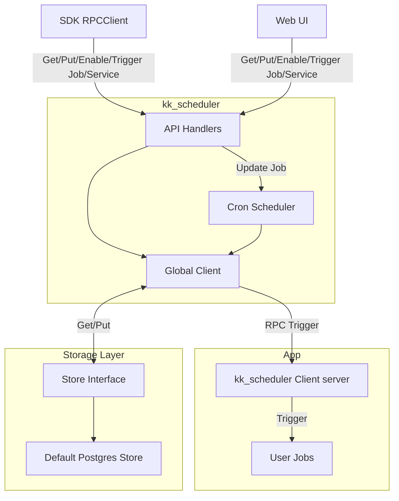

# kk_scheduler

A job scheduling system based on cron and gRPC.

Users register services (gRPC servers), add jobs with cron specs, and the scheduler triggers jobs at scheduled times via gRPC calls.

[](https://deepwiki.com/cruvie/kk_scheduler)

## Features

- Cron-based job scheduling with gRPC triggers
- Web UI for managing services, jobs, tasks, and logs
- Pluggable storage backend
- gRPC + HTTP API for programmatic access

## Screenshots

<table>
  <tr>
    <td></td>
    <td></td>
  </tr>
  <tr>
    <td></td>
    <td></td>
  </tr>
</table>

## System Design



## Deploy

### Docker

[docker-compose](https://github.com/cruvie/kk_scheduler/tree/main/deploy-docker)

```shell
docker compose up -d
```

Visit http://localhost:8668

## Usage

### 1. Install

```shell
go get github.com/cruvie/kk_scheduler/go@latest
```

### 2. Implement trigger server

Run a gRPC server that implements `kk_scheduler.UnimplementedKKScheduleTriggerServer`

See [client_server_test.go](https://github.com/cruvie/kk_scheduler/blob/main/go/internal/scheduler_test/client_server_test.go)

### 3. Register service and job

Put a service and job into kk_scheduler, then enable the job.

See [readme_test.go](https://github.com/cruvie/kk_scheduler/blob/main/go/internal/scheduler_test/readme_test.go)

## Contribute

### Provide more test cases

Any test case PR is welcome.

### Support more storage engines

kk_scheduler uses Postgres as default storage engine, but any storage engine that implements [StoreDriver](https://github.com/cruvie/kk_scheduler/blob/main/go/internal/store_driver/driver.go) can be used.

1. Create a `store_xxxx.go` in `internal/store_driver/` like [postgres.go](https://github.com/cruvie/kk_scheduler/blob/main/go/internal/store_driver/postgres.go)
2. Register it in `NewStoreDriver()` in [driver.go](https://github.com/cruvie/kk_scheduler/blob/main/go/internal/store_driver/driver.go)
3. Add config field in [config.go](https://github.com/cruvie/kk_scheduler/blob/main/go/internal/g_config/config.go) and [config.toml](https://github.com/cruvie/kk_scheduler/blob/main/go/config.toml)

### Improve readme doc and code comments

### Web UI improvements

# TODO

- [ ] support authentication
- [ ] record operation for events(update/trigger)